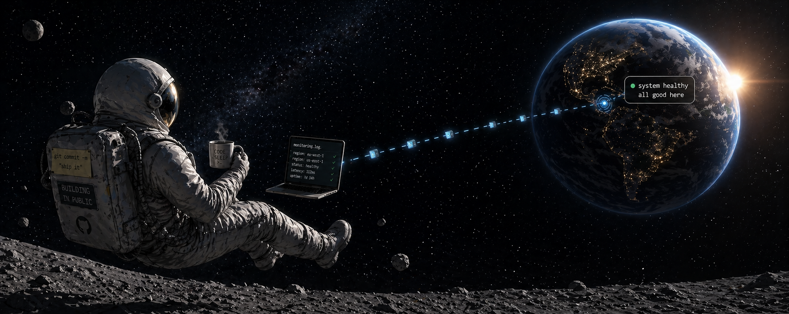

<h1 align="center">Hi, I'm Zain Ali 👋</h1>

<!-- Profile Views Counter -->

<!-- Followers Count Badge -->

  

🚀 Full Stack Developer building end-to-end web applications  
⚙️ Focused on integrating RESTful APIs, database logic, and modern CSS layouts  
📱 Currently delivering responsive, data-driven UIs with a focus on clean code

<!-- Contact Section -->
<table width="100%" cellpadding="0" cellspacing="0">
  <tr>
    <td align="left" valign="middle" style="padding:8px 0;">
      
        <strong>📫 Connect with Me</strong>
      
    </td>
    <td align="right" valign="middle" style="padding:8px 0;">
      <!--  -->
      
      
    </td>
  </tr>
</table>

  

  

<!--    -->

<!--    -->

  

  
  

  

  
  ---

